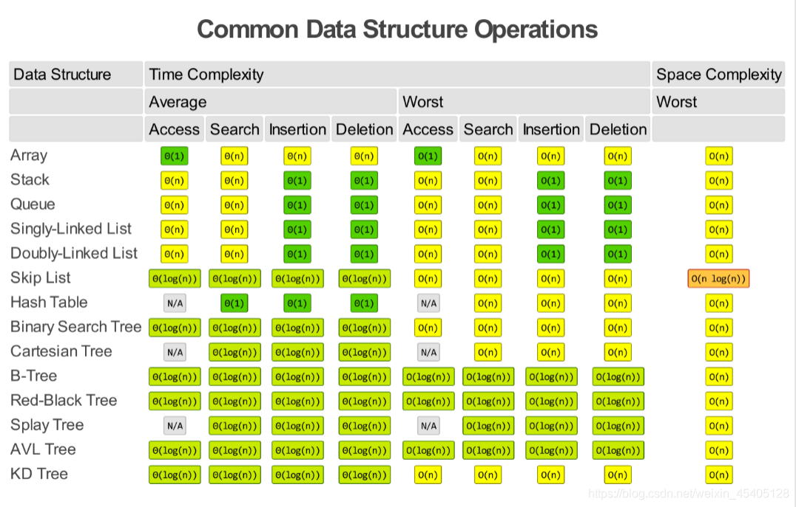

# Data Structures
**What is a container?**
*Not neccessary to know for NOI*  
- A container is a holder object that stores a collection of other objects (its elements)
- The container manages the storage space for its elements and provides member functions to access them (directly or through iterators).  
- Essentially, a container is a specific data structure that contains data.  

In C++, there are generally 3 kinds of STL (Standard Library) containers:

- **Sequence Containers**: data is sequentially ordered
- **Associative Containers**: elements are stored in a sorted order (order does not depend on when the element is inserted)
- **Unordered associative containers**: position of elements does not matter

There are also **container adaptors** which are not full container classes, but classes that provide a specific interface relying on an object of one of the container classes to handle the elements.  
More reading: https://cplusplus.com/reference/stl/

<br>

### Basic Data Structures  
---------------------------

**Array**  
- Fixed sized sequential collection of same data type elements  
```C++
int x[5]; //declaring an array

x[0] = 3; //set the first item in the array to 3

sort(x, x+5); //sorts x in ascending order

reverse(x, x+5); //reverses x
```

<br>

**Vector**  
- Sequence containers representing arrays that can change in size  
- Automatically changes size when element is inserted or deleted   
- Occupies more memory than arrays   
```C++
vector<int> x; //declaring a vector

x.push_back(5); //insert 5 from the back

x.pop_back(); //remove the last item

x.insert(x.begin()+3, 2); //insert 2 at the 4th position

x.erase(x.begin()+1); //remove the 2nd item
```

<br>

**Stack**  
- Container adaptors with LIFO (Last In First Out) operation  
- Only topmost element can be queried or removed
- Insertion only from the top  
```C++
stack<int> x; //declaring a stack

x.push(5); //insert 5 at the top

x.pop(); //remove topmost item

x.size(); //return size of x

x.top() //return topmost item
```

<br>

**Queue**  
- Container adaptors with FIFO (First In First Out) operation  
- Only first and last elements can be queried
- Insertion only from the top, removal only from the back  
```C++
queue<int> x; //declaring a queue

x.push(5); //insert 5 at the back

x.pop(); //remove frontmost item

x.size(); //return size of x

x.front(); //return frontmost item

x.back(); //return last item
```

<br>

**Priority queue**  
- Special type of queue where each element is associated with a priority value  
- Only maximum or minimum elements can be queried
- Smaller constant factors than a multiset  
- Good for when only minimum or maximum elements need to be queried  
```C++
priority_queue<int> x; //declaring a priority queue

x.push(7)
x.push(5)
cout << x.top(); //7
```

<br>

**Deque (double-ended queue)** *pronounced dee-queue or deck*
- Sequence containers that can be efficiently manipulated at both ends  
- Similar to vector, but more efficient in insertion and deletion of elements
```C++
deque<int> x; //declaring a deque

x.push_back(5); //insert 5 from the back

x.pop_back(); //remove the last item

x.push_front(7) //insert 7 from the front

x.pop_front() //remove the first item

x.insert(x.begin()+3, 2); //insert 2 at the 4th position

x.erase(x.begin()+1); //remove the 2nd item

x.front(); //returns frontmost item

x.back(); //returns last item

x.size(); //return size of x
```

<br>

**Set**
- Associative containers that store unqiue elements in a specific order  
- Note that elements are distinct
```C++
set<int> x; //declaring a set

//insert
x.insert(5)
x.insert(6)
x.insert(7)

x.find(5) //returns an iterator that points to 5 in x (-1 in 5 is not in x)

x.lower_bound(5) //returns an iterator to the smallest item in x that is >=5 
x.upper_bound(7) //returns an iterator to the largest item in x that is >=7 
```

<br>

**Unordered set**
- Essentially a set that is unordered (also implemented differently from a set)
```C++
unordered_set<int> x; //declaring a unordered set
```

<br>

**Multiset**
- Essentially a set that can have several copies of the same value
```C++
multiset<int> x; //declaring a multiset
```

<br>

**Unordered multiset**
- Essentially a multiset that is unordered
```C++
unordered_multiset<int> x; //declaring an unordered multiset
```

<br>

**Map**
- Set that contains key-value pairs
- Each element has a key value and a mapped value
- No two mapped values can have the same key values
```C++
map<string, int> x; //declaring a map

//insert
x["word"] = 4;
x["notword"] = 5;
x["awesome"] = 1;
```

<br>

**Unordered map**
- Essentially a map that is unordered
```C++
unordered_map<string, int> x; //declaring an unordered map
```

<br>

### Intermediate(?) Data Structures  
---------------------------

**Policy Based Data Structure**
- Somewhat similar to sets, but with extra, more powerful operations
- Not part of the C++ standard library (but still supported by the g++ compiler)
```C++
//include these headers to use policy-based structures
#include <ext/pb_ds/assoc_container.hpp>
#include <ext/pb_ds/tree_policy.hpp>

//namespace
using namespace __gnu_pbds;

//defining a data structure indexed_set (for int values)
typedef tree<int,null_type,less<int>,rb_tree_tag, tree_order_statistics_node_update> indexed_set;

//defining a data structure multi_indexed_set (for int values)
typedef tree<int,null_type,less_equal<int>,rb_tree_tag, tree_order_statistics_node_update> multi_indexed_set;

indexed_set s;
s.insert(2);
s.insert(5);
s.insert(7);
s.insert(9);

auto x = s.find_by_order(2); //returns an iterator to the element at a given position
cout << *x; //7

cout << s.order_of_key(7); //returns the position of a given element

//these functions work in log(n) time!
```

<br>

**Fenwick Tree**
- calculates the sum of elements over a given range in an array in $O(logn)$ time
- updates the value of an element of in an array in $O(logn)$ time
- requires $O(n)$ memory


<br><br>
### References
- [Guide to Competitive Programming by Antti Laaksonen](https://duoblogger.github.io/assets/pdf/memonvyftw/guide-t-cp.pdf)
- [Data Structures (geeksforgeeks)](https://www.geeksforgeeks.org/data-structures/)
- [Policy Based Data Structure (article by Ansh Gupta)](https://medium.com/nybles/policy-based-data-structure-491ac62ddeaa)

<br><br><br><br>

